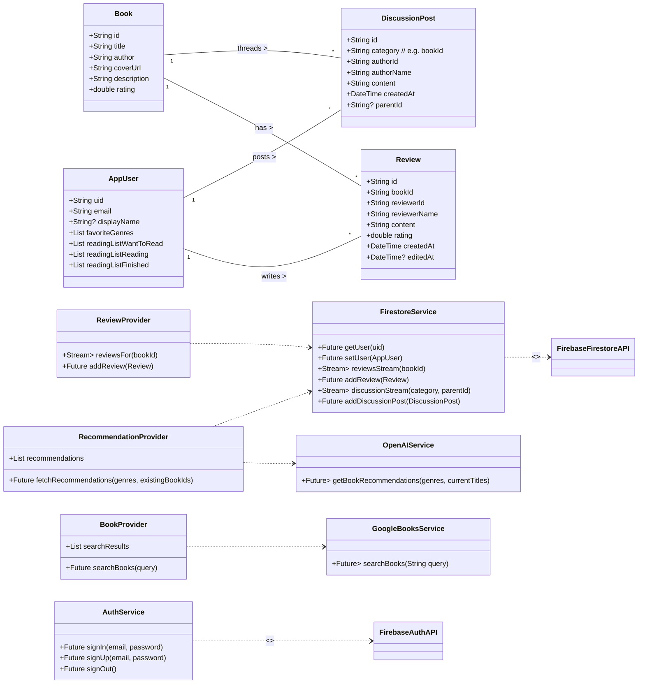

```mermaid

classDiagram
  direction LR

  class AppUser {
    +String uid
    +String email
    +String? displayName
    +List<String> favoriteGenres
    +List<String> readingListWantToRead
    +List<String> readingListReading
    +List<String> readingListFinished
  }

  class Book {
    +String id
    +String title
    +String author
    +String coverUrl
    +String description
    +double rating
  }

  class Review {
    +String id
    +String bookId
    +String reviewerId
    +String reviewerName
    +String content
    +double rating
    +DateTime createdAt
    +DateTime? editedAt
  }

  class DiscussionPost {
    +String id
    +String category      // e.g. bookId
    +String authorId
    +String authorName
    +String content
    +DateTime createdAt
    +String? parentId
  }

  class AuthService {
    +Future<User> signIn(email, password)
    +Future<User> signUp(email, password)
    +Future<void> signOut()
  }

  class FirestoreService {
    +Future<AppUser> getUser(uid)
    +Future<void> setUser(AppUser)
    +Stream<List<Review>> reviewsStream(bookId)
    +Future<void> addReview(Review)
    +Stream<List<DiscussionPost>> discussionStream(category, parentId)
    +Future<void> addDiscussionPost(DiscussionPost)
  }

  class GoogleBooksService {
    +Future<List<Book>> searchBooks(String query)
  }

  class OpenAIService {
    +Future<List<String>> getBookRecommendations(genres, currentTitles)
  }

  class BookProvider {
    +List<Book> searchResults
    +Future<void> searchBooks(query)
  }

  class ReviewProvider {
    +Stream<List<Review>> reviewsFor(bookId)
    +Future<void> addReview(Review)
  }

  class RecommendationProvider {
    +List<String> recommendations
    +Future<void> fetchRecommendations(genres, existingBookIds)
  }

  %% Associations
  AppUser "1" -- "*" Review : writes >
  Book "1" -- "*" Review : has >
  Book "1" -- "*" DiscussionPost : threads >
  AppUser "1" -- "*" DiscussionPost : posts >
  
  %% Providers use Services
  BookProvider ..> GoogleBooksService
  ReviewProvider ..> FirestoreService
  RecommendationProvider ..> OpenAIService
  RecommendationProvider ..> FirestoreService
  AuthService ..> FirebaseAuthAPI : <<uses>>
  FirestoreService ..> FirebaseFirestoreAPI : <<uses>>
```